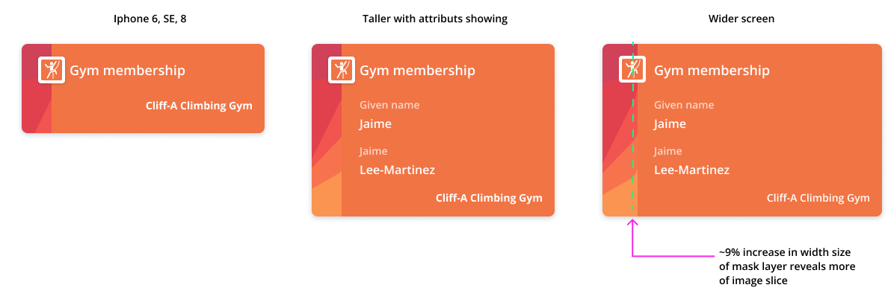
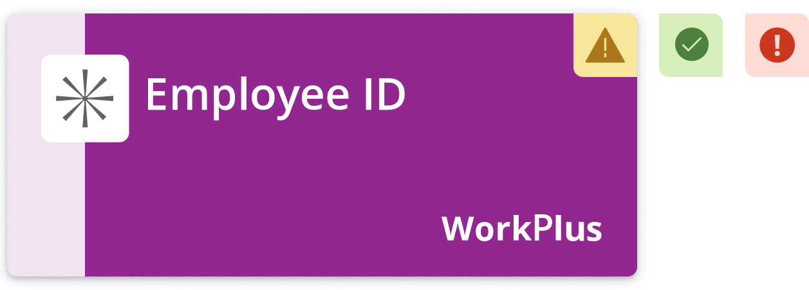
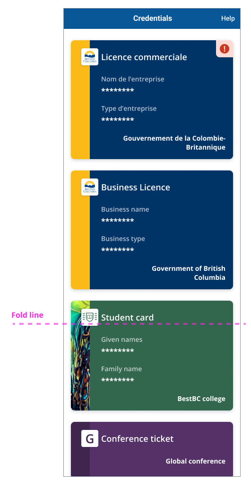
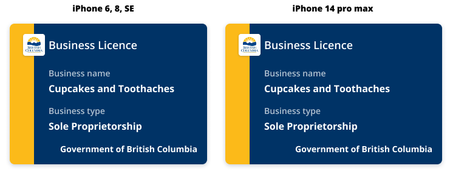
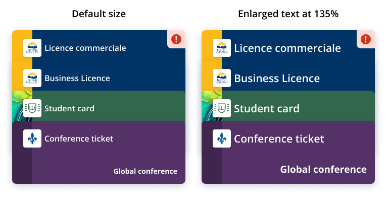

# 0756: OCA for Aries Style Guide

- Authors: [Stephen Curran](mailto:swcurran@cloudcompass.ca)
- Status: [DEMONSTRATED](/README.md#demonstrated)
- Since: 2023-01-05
- Status Note: Implemented in the [Bifold Wallet](https://github.com/openwallet-foundation/bifold-wallet)
- Supersedes: N/A
- Start Date: 2022-11-15
- Versions: 1.0 and 1.1
- Tags: [feature](/tags.md#feature)

[RFC0755 OCA for Aries]: ../0755-oca-for-aries/README.md

## Summary

Support for credential branding in Aries agents is provided by information
provided from the issuer of a given credential type using Overlays Capture
Architecture (OCA) overlays. Aries agents (software) use the issuer-provided OCA
data when displaying (rendering) the issuer’s credential on screens. This style
guide is for issuers to know what information to include in the OCA overlays and
how those elements will be used by holders and verifiers. The style guide is
also for Aries holder and verifier software makers about how to use the OCA data
provided from issuers for a given credential type. It is up to the software
makers to use OCA data provided by the issuers as outlined in this guide.

There are 2 versions of the OCA that can be used. Version 1.1 does not remove version 1.0, but rather propose a different view for credential layout. It is to the wallet maintainer to chose which one would be used in their application.

For more information about the use of OCA in Aries, please see [RFC0755 OCA for
Aries]

## Motivation

OCA Bundles is intended to be used by ALL Aries issuers and ALL Aries Holders. Some
Aries verifiers might also use OCA Bundles. This Style Guide provides guidance for
issuers about what overlays to populate and with what information, and guidance
for holders (and verifiers) about how to use the OCA Bundle data provided by the
issuers when rendering Credentials on screen.

* Issuers **SHOULD** follow this Style Guide in preparing an OCA Bundle for each
  credential type they issue. Holders (and verifiers) **expect** issuers to follow
  the guidance provided in this RFC.
* Holder creators (and verifiers) **SHOULD** follow this Style Guide in
  rendering credentials for users. Issuers **expect** holders (and verifiers) to
  follow the guidance provided in this RFC.

Issuers, holders and verifiers expect other issuers, holders and verifiers to
follow this Style Guide. Issuers, holders and verifiers not following this Style
Guide will likely cause end users to see unpredictable and potential
"unfriendly" results when credentials are displayed.

It is in the best interest of the Aries community as a whole for those writing
Aries agent software to use OCA Bundles and to follow this Style Guide in
displaying credentials.

## Tutorial

Before reviewing this Style Guide, please review and be familiar with [RFC0755
OCA for Aries]. It provides the technical details about OCA, the issuer role in
creating an OCA Bundle and delivering to holders (and optionally, from holders
to verifiers) and the holders role in extracting information from the OCA Bundle
about a held credential. This Style Guide provides the details about what each
participant is expected to do in creating OCA Bundles and using the data in OCA
Bundles to render credentials on screen. 

<!-- Copy and paste the converted output. -->

<!-- The content for the entire next session is converted to markdown from
    a Microsoft Word document stored on Google Drive (link below) using
    the Google Extension "Docs to Markdown" (link below). If necessary
    to reconvert, contact swcurran@cloudcompass.ca, but if you have to
    do it yourself follow these steps. Not the (crazy) step of renumbering
    the images -- that is a limitation of Google Docs and the extension.
    
    If any images are added to the document or changed, the
    images in ./images must be updated as well.
    
    - Install the extension to your Google Doc account
    - Save the Word doc to a Google doc so the extension can be used
    - Use the extension to convert with the options:
       - Demote headings
       - Suppress Info comment
       - Use reckless mode
    - Copy the generated markdown
    - Paste over the section below with the generated markdown, moving the
      introduction section to the "Summary" part of this document above, correcting
      the link by removing the link target portion ("(https://...)") .
    - Make sure that the images in the Google document line up with the images in the images folder. As needed, rename, update and add images to get them to line up with the numbering the document. The image numbering (`NN` in `imageNN.png`) is in the order the image appears in the document, so an inserted images might trigger a major image file renumbering. Sorry...
    - Change all text "./images/" to "./images/"
    - Review a preview of the rendered markdown against the Word doc to make sure the images are in the right order.
    
    Document: https://docs.google.com/document/d/1WPpwzV3uH7KIPAATHGactconcn1J_IQ9
    Extension: https://workspace.google.com/u/0/marketplace/app/docs_to_markdown/700168918607
-->

<!-- Copy and paste the converted output. -->

<!-- You have some errors, warnings, or alerts. If you are using reckless mode, turn it off to see inline alerts.
* ERRORs: 1
* WARNINGs: 0
* ALERTS: 21 -->

## OCA for Aries Style Guide

A Credential User Interface (UI) pulls from a issuer-provided OCA Bundle the following elements:

* **Meta Overlays (multilingual):**
    * Credential name
    * Issuer name
    * Issuer description
    * Issuer URL
    * Credential help text
    * Credential support URL
    * Non-Production watermark
* **“branding” Overlay:**
    * **_logo_** - a URI for an inline or external logo image to display with the credential. See details below about the use and requirements for the image.
    * **_background_image_** -  a URI for an inline or external background image to display with the credential. See details below about the use and requirements for the image.
    * **_background_image_slice_** -  a URI for an inline or external background image slice to display with the credential. See details below about the use and requirements for the image.
    * **_primary_background_color_** - an RGB color code for the credential background
    * **_secondary_background_color_** - an RGB color code for the credential background highlight background color.
    * **_primary_attribute_** - the name of the primary capture base attribute to display \
on the credential.
    * **_secondary_attribute_** - the name of the secondary capture base attribute to \
display on the credential.
    * **_issued_date_attribute_** - the name of a capture base attribute that is the date of issuance of the credential. If there is no such attribute, leave it blank.
    * **_expiry_date_attribute_** - the name of a capture base attribute that is the expiry date of the credential. If there is no such attribute, leave it blank.

### Credential Layouts

This style guide defines three layouts for credentials, the credential list layout, the stacked list layout, and the single credential layout. Holders and verifiers SHOULD display credentials using only these layouts in the context of a screen containing either a list of credentials or a single credential, respectively. Holders and verifiers MAY display other relevant information on the page along with one of the layouts.

The stacked list is the same as the credential layout, with the credentials that are stacked cutoff between elements 6 and 7. Examples of the stacked layout can be seen in the [Stacking](#heading=h.27voxgccn7kf) section of this document. In the Stacked layout, one of the credentials in the stack may be displayed using the full credential list layout.

**Version 1.0**
<table>
  <tr>
   <td>

   </td>
   <td>

   </td>
  </tr>
  <tr>
   <td><strong>Credential List Layout</strong>
   </td>
   <td><strong>Single Credential Layout</strong>
   </td>
  </tr>
</table>

**Version 1.1**
<table>
  <tr>
   <td>

   </td>
   <td>

   </td>
  </tr>
  <tr>
   <td><strong>Credential List Layout</strong>
   </td>
   <td><strong>Single Credential Layout</strong>
   </td>
  </tr>
</table>

**_Figure: Credential Layouts_**

The numbered items in the layouts are as follows. In the list, the OCA data element(s) is provided first, and, where the needed data element(s) is not available through an OCA Bundle, a calculation for a fallback is defined. It is good practice to have code that populates a per credential data structure with data from the credential’s OCA Bundle if available, and if not, populated by the fallbacks. That way, the credentials are displayed in the same way with or without an OCA Bundle per credential. Unless noted, all of the data elements come from the “branding” overlay. Items 10 and 11 are not included in the layouts but are included to document the fallbacks for those values.

1. `logo`
    * Fallback: First letter of the alias of the DIDComm connection
2. `background_image_slice` if present, else `secondary_background_color`
    * Fallback: Black overlay at 24% opacity
3. `primary_background_color`
    * Fallback: Randomly generated color
4. Credential Status derived from revocation status and expiry date (if available)
    * Fallback: Empty
5. Meta overlay item `issuer_name`
    * Fallback: Alias of the DIDComm connection
6. Meta overlay item `name`
    * Fallback: The AnonCreds Credential Definition `tag`, unless the value is either `credential` or `default`, otherwise the AnonCreds `schema_name` attribute from the AnonCreds schema
7. `primary_attribute`
    * Fallback: Empty
8. `secondary_attribute`
    * Fallback: Empty
9. `background_image` if present, else `secondary_background_color`
    * Fallback: Black overlay at 24% opacity (default)
10. `issued_date_attribute`
    * Fallback: If tracked, the date the credential was received by the Holder, else empty.
11. `expiry_date_attribute`
    * Fallback: Empty

**added with version 1.1**

12. `Contact detail button`
    * Fallback: Empty

**Version 1.0**

**Version 1.1**

**_Figure: Template layers_**

The font color is either black or white, as determined by calculating contrast levels (following [Web Content Accessibility Guidelines](https://www.w3.org/WAI/WCAG2AA-Conformance)) against the background colors from either the OCA Bundle or the generated defaults.

**Version 1.0**

<table>
  <tr>
   <td>

   </td>
   <td>

   </td>
  </tr>
</table>

**Version 1.1**

<table>
  <tr>
   <td>

   </td>
   <td>

   </td>
  </tr>
</table>

**_Figure: example of a credential with no override specifications_**

### Logo Image Specifications

This space should not be used for anything other than the issuer logo. The logo image may be masked to fit within a rounded square with varying corner radii. Thus, the logo must be a square image (aspect ratio 1:1), as noted in the table below. The background is default white, therefore logo files with a transparent background will overlay a white background.

For version 1.0, the issuer's name and logo is located at the top left of the credential.

With version 1.1, the issuer's name is located on the bottom right of the credential.

The following are the specifications for the credential logo for issuers. 

Images should be as small as possible to balance quality and download speed. To ensure image quality on all devices, it is recommended to use vector based file types such as SVG. 

<table>
  <tr>
   <td>Preferred file type
   </td>
   <td>SVG, JPG, PNG with transparent background, 
   </td>
  </tr>
  <tr>
   <td>Aspect ratio
   </td>
   <td>1:1
   </td>
  </tr>
  <tr>
   <td>Recommended image size
   </td>
   <td>240x240 px
   </td>
  </tr>
  <tr>
   <td>Color space
   </td>
   <td>RGB
   </td>
  </tr>
</table>

### Background Image Slice Specifications

For issuers to better represent their brand, issuers may specify an image slice that will be used as outlined in the samples below. Note the use of the image in a long, narrow space and the dynamic height. The image slice will be top aligned, scaled (preserving aspect ratio) and cropped as needed to fill the space.

Credential height is dependent on the content and can be unpredictable. Different languages (English, French, etc.) will add more length to names, OS level settings such as font changes or text enlargement will unpredictably change the height of the credential. The recommended image size below is suggested to accommodate for most situations. Note that since the image is top aligned, the top area of the image is certain to be displayed, while the bottom section of the image may not always be visible. 

**Version 1.0**

**Version 1.1**

**_Figure: Examples of the image slice behavior_**

Types of images best used in this area are abstract images or graphical art. Do not use images that are difficult to interpret when cropped.

**Version 1.0**

<table>
  <tr>
   <td>

   </td>
   <td>

   </td>
  </tr>
  <tr>
   <td><strong>Do</strong>

Use an abstract image that can work even when cropped unexpectedly. 
   </td>
   <td><strong>Don’t</strong>

Use images that are hard to interpret when cropped. Avoid words
   </td>
  </tr>
</table>

**Version 1.1**

<table>
  <tr>
   <td>

   </td>
   <td>

   </td>
  </tr>
  <tr>
   <td><strong>Do</strong>

Use an abstract image that can work even when cropped unexpectedly. 
   </td>
   <td><strong>Don’t</strong>

Use images that are hard to interpret when cropped. Avoid words
   </td>
  </tr>
</table>

**_Figure: Background image slice Do’s and Don’ts_**

<table>
  <tr>
   <td>Preferred file type
   </td>
   <td>SVG, PNG, JPG
   </td>
  </tr>
  <tr>
   <td>Aspect ratio
   </td>
   <td>1:10
   </td>
  </tr>
  <tr>
   <td>Recommended image size
   </td>
   <td>120x1200 px
   </td>
  </tr>
  <tr>
   <td>Color space
   </td>
   <td>RGB
   </td>
  </tr>
</table>

### Background Image Specifications

The background image is to give issuers more opportunities to represent their brand and is used in some credential display screens. Avoid text in the background image.

**Version 1.0**

<table>
  <tr>
   <td>

   </td>
   <td>

   </td>
  </tr>
  <tr>
   <td><strong>Do</strong>

Use an image that represents your brand.
   </td>
   <td><strong>Don’t</strong>

Use this image as a marketing platform. Avoid the use of text.
   </td>
  </tr>
</table>

**Version 1.1**

<table>
  <tr>
   <td>

   </td>
   <td>

   </td>
  </tr>
  <tr>
   <td><strong>Do</strong>

Use an image that represents your brand.
   </td>
   <td><strong>Don’t</strong>

Use this image as a marketing platform. Avoid the use of text.
   </td>
  </tr>
</table>

**_Figure: Background image Do’s and Don’ts_**

<table>
  <tr>
   <td>Preferred file type
   </td>
   <td>SVG, PNG, JPG
   </td>
  </tr>
  <tr>
   <td>Aspect ratio
   </td>
   <td>3:1
   </td>
  </tr>
  <tr>
   <td>Recommended image size
   </td>
   <td>1080x360 px
   </td>
  </tr>
  <tr>
   <td>Color space
   </td>
   <td>RGB
   </td>
  </tr>
</table>

### Credential Status

To reduce visual clutter, the issued date (if present), expiry date (if present), and revocation status (if applicable) may be interpreted by an icon at the top right corner when:

* A new credential has been added, based on _issued_date_attribute_, if set, or for a holder agent/wallet, the date the credential was received.
* A credential is revoked, if the credential is revocable and is known to have been revoked.
* A credential is expiring soon or expired, based on _expiry_date_attribute_, if set.

**Version 1.0**

**Version 1.1**

**_Figure: An example demonstrating how the revocation date, expiry date or issued date may be represented._**

The interpretation of the issued date, expiry date and revocation status may be dependent on the holder software, such as a wallet. For example, the specific icons used may vary by wallet, or the full status data may be printed over the credential.

### Credential name and Issuer name guidelines

Issuers should be mindful of the length of text on the credential as lengthy text will dynamically change the height of the credential. Expansive credentials risk reducing the number of fully visible credentials in a list.

**Version 1.0**    

**Version 1.1**   

**_Figure: An example demonstrating how lengthy credentials can limit the number of visible credentials._**

Be mindful of other factors that may increase the length of text and hence, the height of the credential such as translated languages or the font size configured at the OS level.

**Version 1.0**

**Version 1.1**

**_Figure: Examples showing the treatment of lengthy names_**

### Primary and Secondary Attribute Guidelines

If issuers expect people to hold multiples of their credentials of the same type, they may want to specify a primary and secondary attribute to display on the card face. 

Note that wallet builders or holders may limit the visibility of the primary and secondary attributes on the card face to mitigate privacy concerns. Issuers can expect that these attributes may be fully visible, redacted, or hidden.

To limit personal information from being displayed on a card face, only specify what is absolutely necessary for wallet holders to differentiate between credentials of the same type. Do not display private information such as medical related attributes.

**Version 1.0**

<table>
  <tr>
   <td>

   </td>
   <td>

   </td>
  </tr>
  <tr>
   <td><strong>Do</strong>

Use attributes that help users identify their credentials. Always consider if a primary and secondary attribute is absolutely necessary.
   </td>
   <td><strong>Don’t</strong>

Display attributes that contain private information.
   </td>
  </tr>
</table>

**Version 1.1**

<table>
  <tr>
   <td>

   </td>
   <td>

   </td>
  </tr>
  <tr>
   <td><strong>Do</strong>

Use attributes that help users identify their credentials. Always consider if a primary and secondary attribute is absolutely necessary.
   </td>
   <td><strong>Don’t</strong>

Display attributes that contain private information.
   </td>
  </tr>
</table>

**_Figure: Primary/secondary attribute Do’s and Don’ts_**

### Non-production watermark

To identify non-production credentials, issuers can add a watermark to their credentials. The watermark is a simple line of text that can be customized depending on the issuer needs. The line of text will also appear as a prefix to the credential name. The line of text should be succinct to ensure legibility. This watermark is not intended to be used for any other purpose than to mark non-production credentials. Ensure proper localization to the watermark is present in all languages.

Example text include:

* DEMO
* SAMPLE
* NON-PRODUCTION
* TEST
* DEVELOPMENT
* DO NOT USE 

**Version 1.0**

<table>
  <tr>
   <td>

   </td>
   <td>

   </td>
  </tr>
  <tr>
   <td><strong>Do</strong>

Use succinct words to describe the type of issued credential. This ensures legibility and does not increase the size of the credential unnecessarily.
   </td>
   <td><strong>Don’t</strong>

Use long works or words that do not describe non-production credentials.
   </td>
  </tr>
</table>

**Version 1.1**

<table>
  <tr>
   <td>

   </td>
   <td>

   </td>
  </tr>
  <tr>
   <td><strong>Do</strong>

Use succinct words to describe the type of issued credential. This ensures legibility and does not increase the size of the credential unnecessarily.
   </td>
   <td><strong>Don’t</strong>

Use long works or words that do not describe non-production credentials.
   </td>
  </tr>
</table>

### Credential resizing

Credential size depends on the content of the credential and the size of the device. Text areas are resized according to the width. 

**Version 1.0**

**Version 1.1**

**_Figure: Treatment of the credential template on different devices_**

**Version 1.0**

**Version 1.1**

**_Figure: An example of credential on different devices_**

### Stacking

Credentials may be stacked to overlap each other to increase the number of visible credentials in the viewport. The header remains unchanged. The issuer name, logo and credential name will always be visible, but the primary and secondary attributes and the image slice will be obscured. 

In version 1.1, the credential name will always be visible. The issuer name, logo, attributes and the image slice will be obscured. 

**Version 1.0**

**Version 1.1**

**_Figure: An example of stacked credentials with default and enlarged text._**

### Accessibility

The alt-tags for the logo and background images come from the multilingual OCA Meta Overlay for the issuer name and credential type name. 

### More Variations

To view more credential variations using this template, [view the Adobe XD file](https://xd.adobe.com/view/045a1969-719a-4aa5-848f-637ef1b7051a-5109/).

<!-- End of copy and paste the converted output. -->

## Drawbacks

Defining and requesting adherence to a style guide is a lofty goal. With so many
independent issuers, holders and verifiers using Aries, it is a challenge
to get everyone to agree on a single way to display credentials for users. However,
the alternative of everyone "doing their own thing", perhaps in small groups, will
result in a poor experience for users, and be frustrating to both issuers trying
to convey their brand, and holders (and verifiers) trying to create a beautiful
experience for their users.

## Rationale and alternatives

In coming up with this Style Guide, we consider how much control to give
issuers, ultimately deciding that given them too much control (e.g., pixel
precise layout of their credential) creates a usage/privacy risk (people using
their credentials by showing them on screen, with all private data showing), is
technical extremely difficult given the variations of holder devices, and likely
to result in a very poor user experience.

A user experience group in Canada came up with the core design, and the Aries
Working Group reviewed and approved of the Style Guide.

## Prior art

The basic concept of giving issuers a small set of parameters that they could
control in branding of their data is used in many applications and communities.
Relevant to the credential use case is the application of this concept in the
Apple Wallet and Google Wallet. Core to this is the setting of expectations of
all of the participants of how their data will be used, and how to use the data
provided. In the Aries holder (and verifier) case, unlike that of the Apple
Wallet and Google Wallet, is that there is not just one holder that is using the
data from many issuers to render the data on screen, but many holders that are
expected to adhere to this Style Guide.

## Unresolved questions

- A challenge will be in evolving this Style Guide based on new input from those
that use it over time. We expect the Aries RFC version process to be sufficient.
However, this is the first time that this process has been applied to a user
experience "protocol", as opposed to a technical, messaging protocol.
   
## Implementations

The following lists the implementations (if any) of this RFC. Please do a pull request to add your implementation. If the implementation is open source, include a link to the repo or to the implementation within the repo. Please be consistent in the "Name" field so that a mechanical processing of the RFCs can generate a list of all RFCs supported by an Aries implementation.

*Implementation Notes* [may need to include a link to test results](/README.md#accepted).

Name / Link | Implementation Notes
--- | ---
 | 
